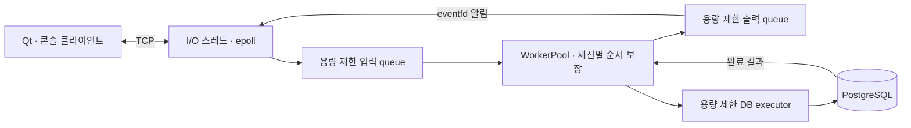

# 프로젝트 소개

C++20과 Linux `epoll`로 구현한 실시간 세션 서버입니다. 여러 사용자가 방을
만들고 채팅·위치 정보를 주고받으며, PostgreSQL에 저장된 사용자 UUID로
같은 이름의 재접속을 복구합니다. Qt 데스크톱·콘솔 클라이언트와 부하 도구를
함께 제공합니다.

이 프로젝트는 **요청 처리 순서, 과부하와 연결 종료의 정확성, 측정에 근거한
지연 개선**을 다룹니다. 아래는 `v0.1.0`의 구현과 검증을 요약한 내용입니다.
[직접 실행하기](../README.md#빠른-시작) · [두 사용자 데모](demo.md) ·
[전체 분석 자료](benchmark.md)

## 구조와 설계 선택

| 선택 | 해결하려는 문제와 대가 |
| --- | --- |
| 소켓을 한 I/O 스레드가 소유 | worker의 소켓 상태 변경 경합을 줄임. 단일 I/O 스레드의 처리량 한계는 추가 측정 대상 |
| 세션별 순서 번호와 직렬 처리 | 여러 worker에서도 마지막 요청보다 연결 종료 정리가 먼저 실행되는 순서 역전을 방지 |
| 입력·출력 queue와 연결별 송신 상한 | 과부하를 읽기 일시정지·생산 제한으로 전달하고 느린 연결을 격리. 한도를 넘는 요청이나 연결은 실패할 수 있음 |
| 별도 DB executor와 deferred completion | 동기 DB 작업 동안 worker가 다른 세션을 처리. 같은 세션의 후속 요청 보관량은 제한 |
| 플랫폼 독립 core와 Linux 네트워크 분리 | 프로토콜·도메인은 여러 OS에서 검증하고, Qt가 서버의 Linux 전용 계층에 의존하지 않도록 구성 |

세부 데이터 흐름과 상한 계약은 [서버 구조](architecture.md), 패킷·버전 협상과
문자열 규칙은 [프로토콜](protocol.md)에 설명합니다.

## 문제 해결 사례

### 과부하로 닫힌 연결의 사용자 상태가 남는 문제

큰 burst에서 세션별 대기 이벤트 상한을 초과한 연결이 종료됐지만 사용자·방
상태가 남았습니다. 거절된 이벤트의 순서 번호가 빠지면서 종료 이벤트까지
대기하거나 거절되는 경로를 확인했습니다.

실패한 세션의 종료 이벤트를 별도 슬롯에 보존하고 진행 중인 처리가 끝난 뒤
정리하도록 수정했습니다. 정상 이벤트 순서는 유지하며 실제 RoomService를
사용한 회귀 테스트로 정리를 검증했습니다. 큰 burst의 상한 초과는 계속 실패로
보고합니다. [재현·계측·수정 근거](performance/2026-09-07-disconnect-diagnostics/README.md)

### 메시지는 모두 도착했는데 소켓 오류가 발생하는 문제

외부 다중 방 부하에서 메시지 누락은 없었지만 서버 소켓 오류를 관측했습니다.
같은 부하 조건에서 클라이언트 종료와 늦은 퇴장 알림이 겹치는
FIN → 늦은 데이터 → RST/EPIPE 경로를 재현했습니다.

성공한 부하 클라이언트가 송신을 half-close한 뒤 남은 데이터를 읽고 EOF를
기다리도록 변경했습니다. 수정 전후 패킷 캡처 조건의 최종 서버 통계는
peer_closed/socket_error **79/1 → 80/0**이었습니다. 정리 실패도 실행 실패로
보고합니다. 최초 관측 1건의 정확한 errno까지 소급 확정한 것은 아닙니다.
[패킷 증거·회귀 검사·한계](performance/2026-09-08-client-close/README.md)

## 성능 분석과 개선

약 40ms의 지연 구간에서 앞선 데이터의 ACK를 받은 직후 다음 데이터를 보내는
흐름을 패킷으로 확인했습니다. 서버만·클라이언트만 TCP_NODELAY를 적용한
대조 실험으로 Nagle과 delayed ACK의 영향을 분리한 뒤 서버 수락 소켓에
TCP_NODELAY를 적용했습니다.

RoomService 잠금도 별도로 계측했습니다. 해당 조건의 chat 24,000표본에서
획득 대기 p99는 0.333µs, 보유 p99는 3.000µs였으며, 이 잠금이 40ms 지연의
주원인이라는 근거는 없었습니다. 이 결과만으로 잠금을 분할하지 않았습니다.
[패킷·TCP 설정 대조·mutex 분석](performance/2026-09-08-latency-analysis/README.md)

최종 전후 비교는 Ubuntu 24.04 arm64·GCC 13.3 Release에서 서버와 부하 생성기를
별도 프로세스로 실행하고 CPU를 각각 0–1, 2–3에 배치했습니다. 20명, worker
2개, client별 300건, payload 256바이트, 초당 10건, warm-up 1회 후 측정 3회입니다.

| 외부 조건 | 변경 전 p99 | 변경 후 p99 | 서버 데이터 패킷 증가 |
| --- | ---: | ---: | ---: |
| 다중 방 4개 | 41.661–42.154ms | 1.707–2.065ms | 약 29.8% |
| 단일 방 | 40.432–40.561ms | 14.035–18.987ms | 약 16.3% |

범위는 측정 3회의 최솟값–최댓값입니다. 단일 방 서버 CPU 시간은 약 5.5%
증가했습니다. 전후 단일 방·다중 방·slow-client의 측정 18회에서 메시지 누락·
중복·클라이언트 실패는 0이었고, 느린 연결은 매회 해당 연결 1개만 상한으로
종료됐습니다.

이 수치는 같은 Linux VM의 loopback 결과이며 최대 처리량이나 실서비스 성능
보장이 아닙니다. 캡처 방식은 조건별 전후에 동일하게 적용했습니다. 누락이 발생한
최초 단일 방 캡처는 비교에서 제외했고, 최종 비교의 캡처 누락은 0입니다.
계측의 타이밍 영향과 남은 지연도 한계로 기록했습니다.
[전후 결과·CPU 비용·원시 데이터](performance/2026-09-08-tcp-nodelay/README.md)

## 검증과 실행

- Linux Release 289개, macOS Qt 188개, Clang ASan/UBSan 282개 테스트 통과
- format-check·tidy-check와 플랫폼별 CI 9개 통과
- 실제 Qt↔콘솔 한글 채팅, 방 퇴장, 연결 종료와 재접속 UUID 복구 확인
- [검증 명령·초기 실패·재검증 기록](performance/2026-09-08-tcp-nodelay/validation.json),
  [데모 절차와 실행 기록](demo.md)

## 구현 범위와 이후 과제

이름 로그인은 인증 기능이 아닙니다. TLS, 영구 방·채팅 기록, 분산 배포는
구현하지 않았습니다. 원격 머신 부하, 최대 처리량과 장시간 안정성도 별도 검증
대상입니다. 추가 최적화는 남은 지연과 더 큰 부하의 병목을 측정한 뒤 결정합니다.
[완료 범위](project-status.md) · [알려진 기술 부채](known-issues.md) · [로드맵](roadmap.md)
